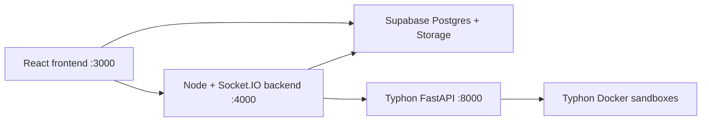

# CodeArena

CodeArena is a gamified coding and developer-community platform. Players solve
problems through the self-hosted Typhon execution engine, earn XP, build
streaks, share posts, join clans and Time Capsules, chat with friends, and
explore graphical learning paths.

## Core Features

- Supabase-backed problem catalog, hidden test cases, submissions, solved state,
  acceptance rate, XP, and activity metrics
- Separate Run and Submit flows:
  - Run executes custom input through Typhon and stores nothing
  - Submit runs server-only hidden tests and persists one submission
- Python 3 and Java 21 execution through Typhon Docker sandboxes
- Profile, graphical streak calendar, posts, followers, and Career Loadout
- Friends, direct messages, persistent group chats, and notifications
- Clans, Time Capsules, Rabbit Hole learning paths, and Power Up Hunt
- Global light and dark themes

## Architecture



Hidden problem tests are only read by the Node backend using the Supabase
service-role key. Never expose that key to the React frontend.

## Project Structure

```text
backend/
  http.js                         HTTP request helpers
  problems.js                     Catalog, hidden-test judging, metrics
  problem-schema.sql              Problems, tests, submissions, seed data
  server.js                       REST API and Socket.IO server
  supabase.js                     Backend Supabase client
  supabase-schema.sql             Combined earlier feature schema
  typhon.js                       Typhon execution client
  social-schema.sql               Posts, follows, notifications
  profile-activity-schema.sql     Streak activity
  profile-pics-storage-schema.sql Storage bucket policies
  time-capsule-schema.sql         Time Capsules
Typhon/
  runner/                         FastAPI execution service and sandboxes
src/
  features/problems/problemApi.js Problem and Typhon frontend API
  features/careerLoadout/         Career metric calculations
  pages/                          Application pages
  styles/                         Page-specific styles
```

## Requirements

- Node.js 18+
- npm
- Python 3.11+
- Docker Desktop
- A Supabase project

## Supabase Setup

The existing application expects these core tables:

- `lusers`
- `friends`
- `friend_requests`

The `lusers` table must include at least:

- `id`
- `username`
- `uusername`
- `age`
- `xp`
- `profile_pic`

Run the feature SQL files in the Supabase SQL editor:

```text
backend/supabase-schema.sql
backend/social-schema.sql
backend/problem-schema.sql
backend/profile-pics-storage-schema.sql
```

`backend/problem-schema.sql` creates and seeds:

- `problems`
- `problem_test_cases`
- `problem_submissions`
- `user_problem_progress`

It also creates the trigger that:

- Updates submission and acceptance counts
- Marks problems as solved
- Awards difficulty XP only on the first accepted submission
- Updates the user XP value
- Adds accepted submissions to `user_activity`

### Backend Environment

Set these before starting the backend:

```powershell
$env:SUPABASE_URL="https://your-project.supabase.co"
$env:SUPABASE_SECRET_KEY="sb_secret_your-secret-key"
$env:TYPHON_URL="http://localhost:8000"
npm run start:socket
```

`SUPABASE_SECRET_KEY` is recommended for submissions because hidden test cases
must not be readable with the public frontend key. The legacy
`SUPABASE_SERVICE_ROLE_KEY` variable remains supported.

## Installation

```powershell
npm install
npm run typhon:install
```

## Start Typhon

Build the Python and Java sandbox images:

```powershell
npm run typhon:build
```

Start the Typhon FastAPI service:

```powershell
npm run typhon:start
```

Typhon runs at:

```text
http://localhost:8000
http://localhost:8000/docs
```

## Start CodeArena

Terminal 1:

```powershell
npm run typhon:start
```

Terminal 2:

```powershell
$env:SUPABASE_SECRET_KEY="sb_secret_your-secret-key"
npm run start:socket
```

Terminal 3:

```powershell
npm start
```

Open `http://localhost:3000`.

## Commands

| Command | Purpose |
| --- | --- |
| `npm start` | Start the React frontend |
| `npm run start:socket` | Start REST API, judge service, and Socket.IO |
| `npm run typhon:install` | Install Typhon Python dependencies |
| `npm run typhon:build` | Build Typhon Python and Java sandbox images |
| `npm run typhon:start` | Start Typhon on port 8000 |
| `npm run build` | Create a production frontend build |

## Problem Judging

### Run

```http
POST /api/typhon/run
```

Runs the selected source code against custom input. The input, source, and
result are not persisted by CodeArena.

### Submit

```http
POST /api/problems/:problemId/submit
```

The backend:

1. Loads hidden test cases using the Supabase service-role key.
2. Executes every case in an isolated Typhon container.
3. Accepts only when every expected output matches.
4. Stores one submission record.
5. Updates acceptance rate, solved state, activity, and first-solve XP.

Hidden tests make unrelated or hard-coded solutions substantially harder to
accept. Like every test-based judge, correctness is defined by the completeness
of the test suite, so add edge cases whenever a weak solution is discovered.

Complexity shown after submission includes the expected problem complexity and
a clearly labelled static source estimate. Static complexity analysis is
heuristic and does not determine acceptance.

## XP Rewards

| Difficulty | First-solve XP |
| --- | ---: |
| Easy | 20 |
| Medium | 50 |
| Hard | 100 |

Repeated accepted submissions update metrics but do not award the problem XP
again.

## Security Notes

The project currently uses a custom `lusers` session stored in browser
localStorage. Before production:

1. Migrate to Supabase Auth.
2. Add user-scoped RLS policies.
3. Keep the service-role key backend-only.
4. Restrict backend CORS origins.
5. Review and expand hidden test suites.
6. Keep Typhon Docker network isolation and resource limits enabled.
